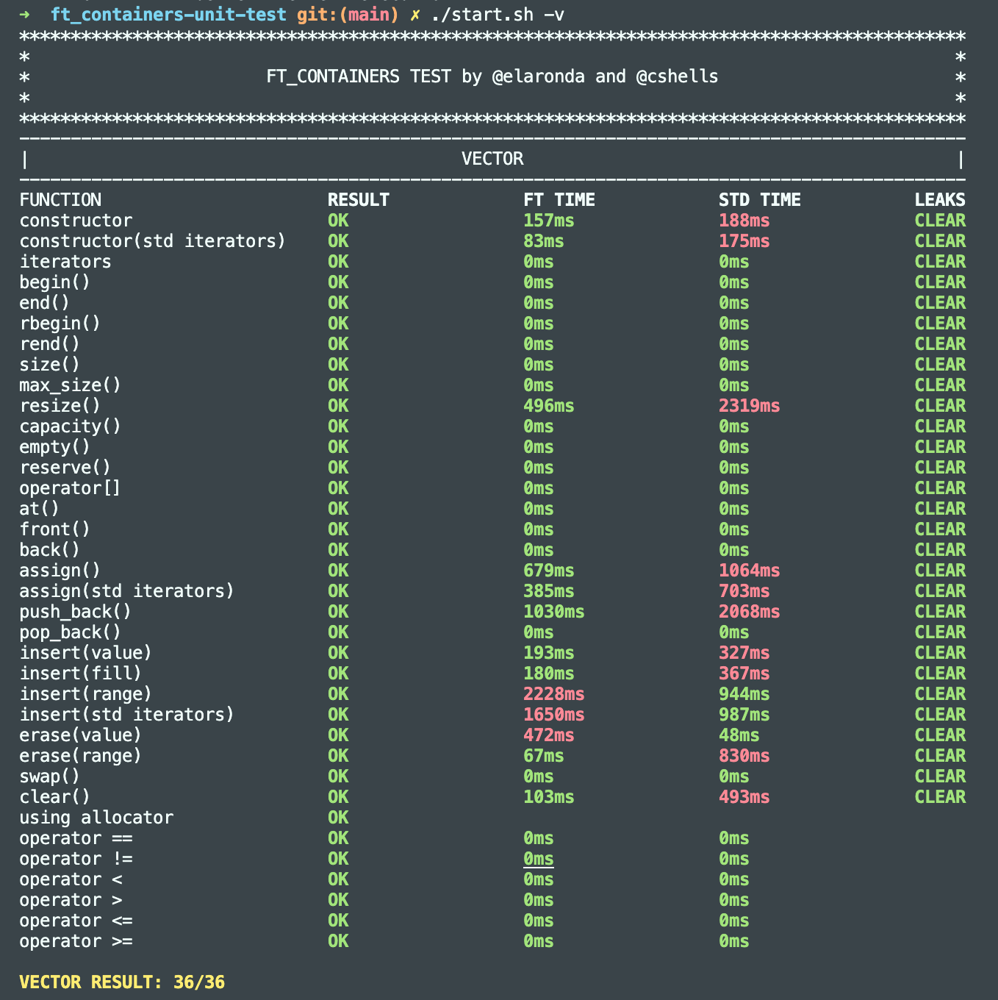

# Implement containers : vector, map and stack

A container is a holder object that stores a collection of other objects (its elements). They are implemented as class templates, which allows a great flexibility in the types supported as elements.

The container manages the storage space for its elements and provides member functions to access them, either directly or through iterators (reference objects with similar properties to pointers).

Containers replicate structures very commonly used in programming: dynamic arrays (vector), queues (queue), stacks (stack), heaps (priority_queue), linked lists (list), trees (set), associative arrays (map)...

## Vector

Vectors are sequence containers representing arrays that can change in size.

Just like arrays, vectors use contiguous storage locations for their elements, which means that their elements can also be accessed using offsets on regular pointers to its elements.
But unlike arrays, their size can change dynamically, with their storage being handled automatically by the container.

## Allocators

Allocators are objects responsible for encapsulating memory management. 

std::allocator is used when you want to separate allocation and do construction in two steps. 
It is also used when separate destruction and deallocation is done in two steps. 

All the STL containers in C++ have a type parameter Allocator that is by default std::allocator.
	template <class T> class allocator;

Member functions associated with std::allocator() :

	address: It is used for obtaining the address of an object although it is removed in C++20.

	construct: It is used to construct an object.It is also removed in C++20.

	destroy: It is used to destruct an object in allocated storage.It is also removed in C++20.

	max_size: It returns the largest supported allocation size.It is deprecated in C++17 and removed in C++20.

	allocate: Used for allocation of memory.

	deallocate: Used for deallocation of memory.

## Iterators

An iterator is any object that, pointing to some element in a range of elements (such as an array or a container), has the ability to iterate through the elements of that range using a set of operators (such increment (++)).

### Iterator_traits
iterator_traits is a template class in the C++ Standard Library that provides a way to obtain information about the properties of an iterator type. It is defined in the <iterator> header.

The iterator_traits template has a single template parameter, which is the type of the iterator. It defines several member types and constants that provide information about the iterator type, such as its value_type, difference_type, reference, pointer, and iterator_category.

### Reverse iterator

Reverse_iterator is an iterator adaptor that reverses the direction of a given iterator.
It produces a new iterator that moves from the end to the beginning of the sequence defined by the underlying bidirectional iterator.

## Enable_if

The enable_if family of templates is a set of tools to allow a function template or a class template specialization to include or exclude itself from a set of matching functions or specializations based on properties of its template arguments.

std::enable_if is an important function to enable certain types for template specialization via some predicates known at the compile time. Using types that are not enabled by std::enable_if for template specialization will result in compile-time error.

If B is true, std::enable_if has a public member typedef type, equal to T; otherwise, there is no member typedef.

## Is_integral

std::integral_constant wraps a static constant of specified type. It is the base class for the C++ type traits.

## General use cases for C++ containers

## Sources

vector
https://cplusplus.com/reference/vector/vector/

iterators
https://www.youtube.com/watch?v=F9eDv-YIOQ0
https://cplusplus.com/reference/iterator/

allocator
https://cplusplus.com/reference/memory/allocator/
https://medium.com/@vgasparyan1995/what-is-an-allocator-c8df15a93ed
https://www.geeksforgeeks.org/stdallocator-in-cpp-with-examples/

size & capacity & max_size
https://www.fluentcpp.com/2017/10/13/size-capacity-stl-containers/
https://en.cppreference.com/w/cpp/container/vector/max_size

